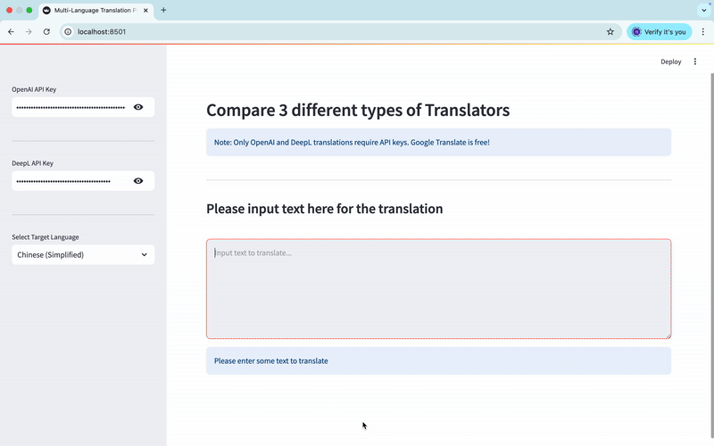
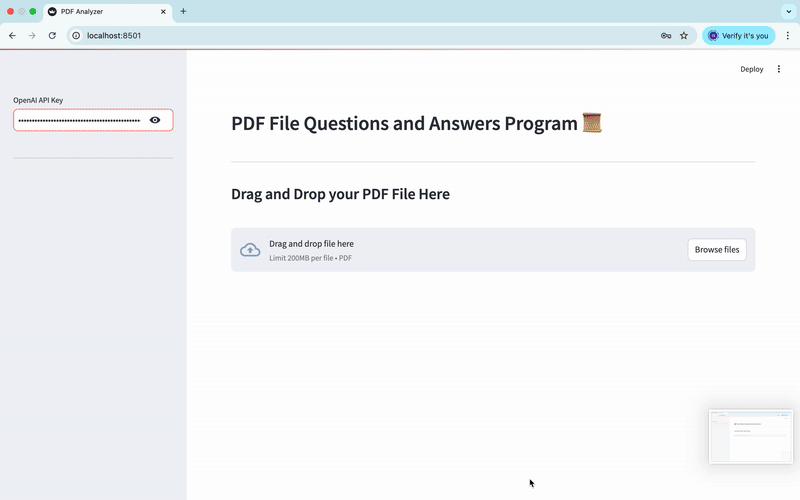

# Content Processing and Translation Systems

A multi-modal approach to language and content analysis with three integrated Python-based applications:
1. Multi-Platform Translation Service
2. YouTube Video Content Summarization
3. PDF Document Question-Answering System

## System Architecture


## Project Features

### Multi-Platform Translation Service
Compare translations across multiple platforms (OpenAI, DeepL, Google Translate) in a unified interface:
- Integrated caching system for optimization
- Rate limiting to prevent API throttling
- Asynchronous processing for Google Translate



**[Full Demo Video](./video_demo/Problem1_TranslationComparison.mov)**

### YouTube Video Content Summarization
Extract and summarize content from YouTube videos:
- Extracts video transcripts automatically
- Uses LangChain for creating concise summaries
- Map-reduce approach for handling videos of any length


**[Full Demo Video](./video_demo/Problem2_VideoContentExtraction.mov)**

### PDF Question-Answering System
Interact with PDF documents through natural language questions:
- Text chunking and embedding for efficient processing
- FAISS vector store for fast content retrieval
- Conversational interface for document Q&A



**[Full Demo Video](./video_demo/Problem3_PDFContentProcessing.mov)**

## Installation

```bash
# Clone the repository
git clone https://github.com/yourusername/your-repo-name.git
cd your-repo-name

# Create and activate a virtual environment
python -m venv venv
source venv/bin/activate  # On Windows, use: venv\Scripts\activate

# Install dependencies
pip install -r requirements.txt
```

## Usage

### Multi-Platform Translation Service
```bash
streamlit run Problem1_TranslationComparison.py
```

### YouTube Video Summarizer
```bash
streamlit run Problem2_VideoContentExtraction.py
```

### PDF Question-Answering System
```bash
streamlit run Problem3_PDFContentProcessing.py
```

## Requirements

- Python 3.8+
- OpenAI API key
- DeepL API key (optional for translation service)
- Streamlit
- LangChain
- FAISS
- PyPDF2
- YouTube-Loader

See `requirements.txt` for full dependencies.

## Technical Challenges & Limitations

- API rate limits and quota restrictions
- Token count limitations for large content
- High memory usage for large PDF processing

## Future Improvements

- Unified API key management
- Distributed processing for scalability
- Custom embedding models for improved accuracy
- Enhanced UI/UX with real-time progress tracking

## License

[MIT License](LICENSE)